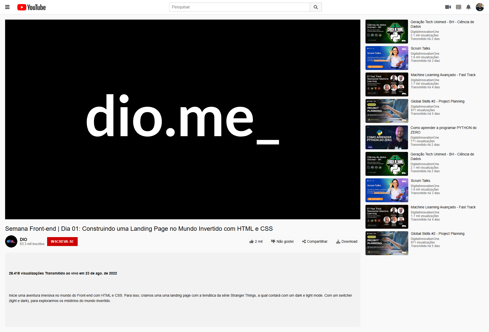

Clone da Página de Vídeo do YouTube (HTML & CSS Responsivo)
Este projeto é um clone responsivo da página de visualização de vídeos do YouTube, construído utilizando apenas HTML e CSS. O objetivo é replicar a estrutura e o layout visual da interface do YouTube, garantindo que o design se adapte a diferentes tamanhos de tela, desde desktops grandes até dispositivos móveis.

Visão Geral do Projeto
O projeto foca na criação de uma interface limpa e funcional, imitando os principais elementos da página de vídeo do YouTube, como o cabeçalho, o player de vídeo, as informações do vídeo (título, canal, ações) e a barra lateral de vídeos sugeridos.

Screenshot / Pré-visualização
Aqui está uma pré-visualização do projeto:

Funcionalidades
Cabeçalho Responsivo: Barra superior com logo, campo de busca e ícones de usuário, que se adapta a diferentes larguras de tela.

Layout de Vídeo e Barra Lateral: O player de vídeo ocupa a maior parte da tela em desktops, enquanto uma barra lateral exibe vídeos sugeridos. Em telas menores, o layout se ajusta para empilhar os elementos verticalmente.

Seção de Informações do Vídeo: Exibe o título do vídeo, detalhes do canal (nome, inscritos), botões de interação (curtir, não curtir, compartilhar, download) e a descrição do vídeo.

Design Responsivo: Utiliza Flexbox e Media Queries para garantir que a página seja visualmente agradável e funcional em qualquer dispositivo (desktops, tablets e smartphones).

Ícones: Integração com Font Awesome para os ícones da interface.

Como Executar o Projeto
Para visualizar este projeto em seu navegador, siga estes passos simples:

Clone o Repositório:

git clone <URL_DO_SEU_REPOSITORIO>

(Substitua <URL_DO_SEU_REPOSITORIO> pela URL real do seu repositório GitHub)

Navegue até a Pasta do Projeto:

cd nome-da-pasta-do-seu-projeto

Abra o Arquivo HTML:
Abra o arquivo index.html em seu navegador web preferido (Google Chrome, Firefox, Safari, etc.).

Estrutura de Arquivos
index.html: Contém a estrutura HTML da página.

style.css: Contém todos os estilos CSS para o layout e responsividade.

Responsividade
O design foi construído com uma abordagem "mobile-first" em mente e utiliza @media queries para adaptar o layout a diferentes tamanhos de tela:

Telas Grandes (Desktops): Layout com player de vídeo à esquerda e barra lateral à direita.

Telas Médias (Tablets): O player de vídeo e a barra lateral se empilham verticalmente. O cabeçalho e os botões de ação do vídeo também se ajustam.

Telas Pequenas (Smartphones): O layout é otimizado para visualização em dispositivos móveis, com elementos ajustados para melhor usabilidade.

Personalização
Imagens: Substitua as URLs dos placeholders (https://placehold.co/...) pelas suas próprias imagens (logo do YouTube, avatares, miniaturas de vídeo).

Vídeo: Para um player de vídeo funcional, você pode incorporar um <iframe> do YouTube ou usar um elemento <video> com seus próprios arquivos de vídeo.

Conteúdo: Altere os textos, títulos e descrições para o conteúdo desejado.

Cores e Fontes: Modifique as variáveis de cor e as propriedades de fonte no arquivo style.css para combinar com sua preferência.

Sinta-se à vontade para explorar, modificar e usar este código como base para seus próprios projetos!